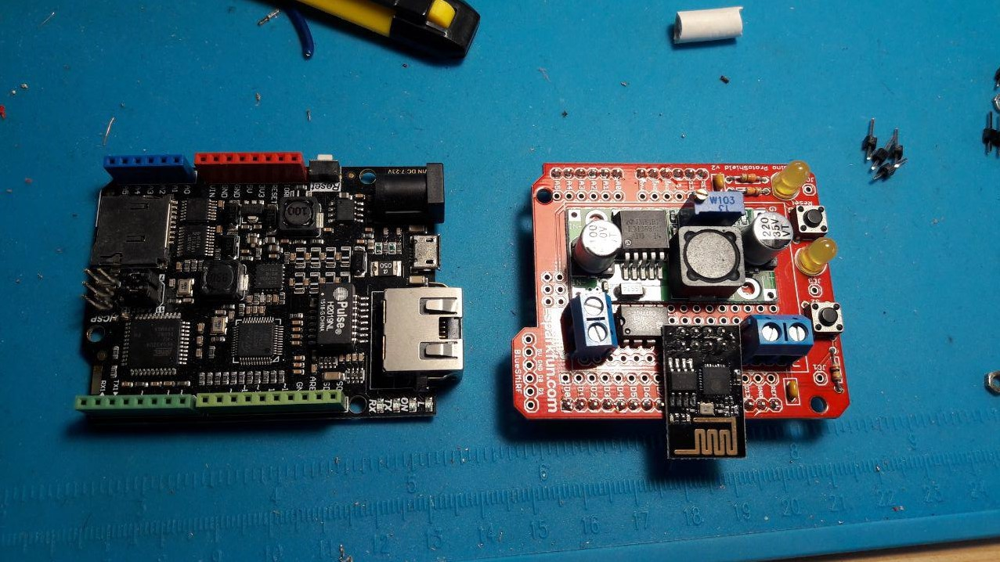

# SBB split flap displays with Arduino Support

Documentation and code for interfacing with SBB split flap display modules.
Most documentation in this repository is forked from [https://github.com/adfinis-sygroup/sbb-fallblatt](https://github.com/adfinis-sygroup/sbb-fallblatt)

## RS-485 interface

### Simple interface buid with 8pin chip (Max485, or other compatible chip)

Based on Arduino ProtoShiel from Sparkfun
 - DC/DC power duck (original Omega module provide 36V DC)
 - Support ESP8266 AT Mode
